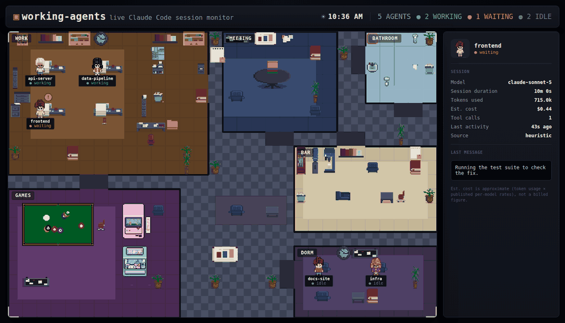
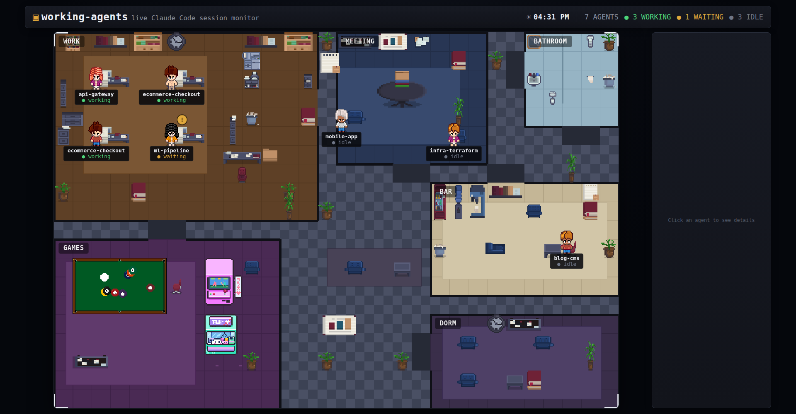
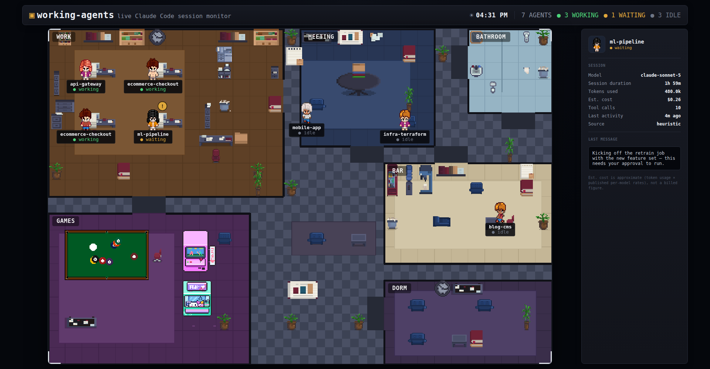

<h1 align="center">working-agents</h1>

<p align="center"><b>Your Claude Code sessions, alive in a pixel-art office.</b></p>

<p align="center">
  <a href="https://github.com/diogocouto18/working-agents/actions/workflows/ci.yml"></a>
  = 20" src="https://img.shields.io/badge/node-%3E%3D20-339933?logo=node.js&logoColor=white">
  
  
  
</p>

<p align="center">
  <a href="#features">Features</a> •
  <a href="#how-it-works">How it Works</a> •
  <a href="#the-daily-schedule">Daily Schedule</a> •
  <a href="#quick-start">Quick Start</a> •
  <a href="#configuration">Configuration</a> •
  <a href="#troubleshooting">Troubleshooting</a> •
  <a href="#credits">Credits</a>
</p>

<br>

A small local web app that turns every active Claude Code session on your
machine into a character walking around a 6-room pixel office — working at
a desk, waiting on a permission prompt, or idle at the bar, the games room,
or asleep in the dorm — updated in real time from the actual session data
on disk, not a simulation.

<p align="center">
  
</p>

<p align="center">
  
</p>

## Why

Running several Claude Code sessions in parallel across terminal tabs means
losing track of which one is actually doing something, which one is stuck
waiting for a permission prompt, and which one has been idle for twenty
minutes. `working-agents` answers that at a glance: a status board for your
own agents, styled as an office instead of a table.

It's in the same spirit as [pixel-agents](https://github.com/pablodelucca/pixel-agents)
and its forks — a small genre that's emerged specifically around
visualizing Claude Code activity — but built from scratch for this
workflow, with two things those don't do:

- **Real cost and token accounting.** Every character carries its session's
  actual `input`/`output`/`cache_read`/`cache_creation` token counts, read
  straight from the JSONL transcript and priced against current per-model
  rates. Click a character to see it.
- **A daily routine, not just a status dot.** Idle agents don't just stand
  around — they follow an actual schedule (coffee breaks, lunch, end of
  day, bed) instead of drifting to a random spot in the office.

## Features

- 🟢 Live status per session — **working** / **waiting** / **idle** —
  hook-precise when available, heuristic otherwise
- 💰 Real per-session cost and token usage, estimated from actual usage
  data against current model pricing
- 🔍 Click any character for a full detail panel: model, session duration,
  tokens, cost, tool calls, last activity, last message
- 🏢 A 6-room pixel office — work, meeting room, bathroom, bar, games room,
  dorm — each one labeled on the map
- 🧵 Subagents are tracked too, shown distinctly from top-level sessions
- 📅 A real daily schedule for idle agents instead of random wandering
- 📦 Zero runtime dependency on anything outside the repo — sprite sources
  are vendored under `assets-src/`, not fetched from elsewhere

<p align="center">
  
</p>

## How it Works

```
~/.claude/projects/**/*.jsonl  →  sessionParser.js  →  status + usage + cost
                                        ↓
~/.claude/settings.json hooks  →  claude-hook.js  →  hookState.js  (overrides heuristic when fresh)
                                        ↓
                                   scanSessions.js  →  world.js (pathfinding, schedule)
                                        ↓
                              WebSocket  →  client/index.html (pixel office)
```

**Status detection is two-layered**, same idea as the rest of this genre of
tool:

1. **Hooks (precise).** `scripts/install-hooks.py` wires `SessionStart`,
   `PreToolUse`, `PostToolUse`, `PermissionRequest`, `Notification`,
   `Stop`, `SubagentStart`/`Stop` and `SessionEnd` in your Claude Code
   settings to POST to this server. A fresh hook event (< 20s old) wins.
2. **Heuristic (fallback).** With no recent hook event, `sessionParser.js`
   infers status from the JSONL transcript itself: a recent turn means
   *working*, a dangling `tool_use` with no matching `tool_result` means
   *waiting*, and silence past 5 minutes means *idle*.

**Movement** is a small waypoint graph, not a full pathfinding grid: every
room has a door connected to a central hallway hub, so a character visibly
walks out of one room, across the hallway, and into another. **The office
background and character sprites** are pre-rendered once by
`scripts/generate-office.py` from vendored CC0/CC-BY sprite packs (see
[Credits](#credits)) — the server itself only pushes positions and status
over WebSocket, it does no rendering.

## The Daily Schedule

Idle agents follow this routine (local time). Working/waiting agents always
stay at their desk regardless of the clock — this only governs what an idle
agent does with its downtime, it's not a claim about when real activity
happens:

| Time | Idle agents go to |
|---|---|
| 08:00 – 11:00 | free roam |
| 11:00 – 11:30 | ☕ bar (break) |
| 11:30 – 13:00 | free roam |
| 13:00 – 14:00 | 🍽️ bar (lunch) |
| 14:00 – 16:45 | free roam |
| 16:45 – 17:15 | ☕ bar (break) |
| 17:15 – 18:00 | free roam |
| 18:00 – 20:00 | 🎮 games room (end of day) |
| 20:00 – 21:00 | 🍽️ bar (dinner) |
| 21:00 – 00:00 | 🎮 games room |
| 00:00 – 08:00 | 🛏️ dorm (asleep) |

Tune it in `SCHEDULE` at the top of `server/world.js`.

## Requirements

- **Node.js 20 or newer** and npm — runs the server.
- **Python 3** — only needed for the optional helper scripts:
  `scripts/install-hooks.py` (standard library only) and
  `scripts/generate-office.py` (also needs Pillow).
- **Claude Code**, with session transcripts under `~/.claude/projects`.

## Quick Start

```bash
npm install
npm run dev
```

Then open **http://localhost:4242**. The server prints the directory it is
watching on startup; start (or keep using) a Claude Code session and its
character appears within a few seconds.

## Configuration

All settings are optional environment variables:

| Variable | Default | Read by | Purpose |
|---|---|---|---|
| `PORT` | `4242` | server | Port the dashboard and WebSocket listen on. |
| `HOST` | `127.0.0.1` | server | Interface to bind. Keep it on loopback — there is no authentication (see [Security model](#security-model)). |
| `WORKING_AGENTS_PROJECTS_DIR` | `~/.claude/projects` | server | Directory scanned for session `.jsonl` files. Point it elsewhere for a custom Claude Code config directory or a demo. |
| `WORKING_AGENTS_PRICING` | `pricing.json` next to `package.json` | server | Optional pricing override file (USD per 1M tokens); see [Custom model pricing](#optional-custom-model-pricing). |
| `WORKING_AGENTS_URL` | `http://127.0.0.1:4242` | hook script | Where `server/claude-hook.js` sends hook events. Set it (in the environment Claude Code runs in) if you changed `PORT` or `HOST`. |

```bash
PORT=5000 npm run dev
WORKING_AGENTS_URL=http://127.0.0.1:5000 claude   # so the hooks find the server
```

## Platform Support

The server is plain Node.js with no platform-specific code, but it has been
developed and used on **Linux (WSL2 Ubuntu)** only. macOS should work as is;
native Windows is untested.

**Windows / WSL.** The server, the hook script and Claude Code must all see
the same `.claude` directory:

- Claude Code inside WSL: run the server inside WSL too and open
  `http://localhost:4242` from your Windows browser (WSL2 forwards
  localhost by default).
- Claude Code on native Windows, server inside WSL: point
  `WORKING_AGENTS_PROJECTS_DIR` at the Windows profile, for example
  `/mnt/c/Users/<you>/.claude/projects`. File-change events do not
  propagate reliably over `/mnt/c`, so updates then arrive on the server's
  5-second poll instead of instantly.
- Run `scripts/install-hooks.py` with the Python of the same environment
  as Claude Code, since it edits `~/.claude/settings.json` of whoever runs
  it.

### Security model

The server is a local dev tool and listens on `127.0.0.1` only by default
(override with `HOST`). It rejects any request whose `Host` header is not a
loopback address or whose `Origin` header is not the dashboard itself, which
blocks other web pages open in your browser (including DNS-rebinding
attempts) from reading session data over the WebSocket or forging `/hook`
events. It has no authentication, so do not expose it beyond your machine
(e.g. `HOST=0.0.0.0`) on an untrusted network.

### Optional: precise status via hooks

Requires Python 3 and an existing `~/.claude/settings.json`.

Without hooks, status is inferred from JSONL timestamps alone (still
accurate, just a bit less immediate). To wire up the real thing:

```bash
python3 scripts/install-hooks.py
```

This merges a `hooks` block into `~/.claude/settings.json` (backing it up
first) without touching anything else already there. It's idempotent —
safe to re-run. Restart any active Claude Code sessions (or open `/hooks`
once) for the config to take effect.

### Optional: custom model pricing

Costs are estimated from built-in per-model rates. For a model the server
does not know yet, it logs a one-time warning, prices the session at a
default rate and marks the cost in the detail panel as estimated
(`~$1.23 (default rate)`). To add or override rates, copy the example and
edit it:

```bash
cp pricing.example.json pricing.json   # USD per 1M tokens, git-ignored
```

```json
{
  "default": { "input": 3.0, "output": 15.0 },
  "claude-example-model": { "input": 4.0, "output": 20.0 }
}
```

Set `WORKING_AGENTS_PRICING` to read the file from another path. Restart the
server after editing.

### Optional: regenerate the office background

The background and character sprites are pre-rendered PNGs, already
checked into `client/assets/`. You only need to regenerate them if you
change the layout in `scripts/generate-office.py`:

```bash
python3 -m venv .venv && .venv/bin/pip install pillow
.venv/bin/python scripts/generate-office.py
```

## Project Layout

```
server/
  index.js          HTTP + WebSocket server, hook endpoint, tick loop
  sessionParser.js   .jsonl → status, usage, cost (the heuristic layer)
  hookState.js       in-memory hook-driven status (the precise layer)
  scanSessions.js     finds active sessions, merges hook + heuristic
  world.js           pathfinding, seat assignment, the daily schedule
  pricing.js         per-model token pricing
  claude-hook.js      the script Claude Code itself invokes on hook events
client/
  index.html          the pixel office UI (vanilla JS + WebSocket)
  assets/             pre-rendered office background and character sprites
scripts/
  generate-office.py  builds office-bg.png + character sprites from assets-src/
  install-hooks.py    one-time, user-run installer for the Claude Code hooks
assets-src/           vendored sprite packs (see Credits below)
```

## Troubleshooting

**No agents appear.** Work through these in order:

1. **Check the watched directory.** The server logs `watching <path>` on
   startup. That directory must contain `<project>/<session>.jsonl` files
   (`ls ~/.claude/projects/*/`). If your transcripts live elsewhere, set
   `WORKING_AGENTS_PROJECTS_DIR`.
2. **Sessions must be recent and non-empty.** Only transcripts modified in
   the last 30 minutes and containing at least one conversation turn are
   shown. Send a message in a Claude Code session and wait a few seconds.
3. **Same machine and user.** A server running in WSL does not see the
   `~/.claude` of your Windows user, and vice versa — see
   [Platform Support](#platform-support).
4. **Blank page or a 403 in the browser console.** Open the dashboard via
   `http://localhost:<PORT>` or `http://127.0.0.1:<PORT>`. Requests with any
   other `Host` or `Origin` are rejected on purpose.
5. **Port already in use.** Set another `PORT`, and `WORKING_AGENTS_URL` for
   the hooks.

**Agents show but the status feels laggy or the panel says `heuristic`.**
Hooks are not installed or not reaching the server. Run
`python3 scripts/install-hooks.py`, restart your Claude Code sessions, and
make sure `WORKING_AGENTS_URL` matches the server's address. The hooks fail
silently by design, so a stopped server never affects Claude Code.

## Contributing

See [CONTRIBUTING.md](CONTRIBUTING.md).

## Credits

| Pack | Author | License |
|---|---|---|
| [MetroCity](https://jik-a-4.itch.io/metrocity-free-topdown-character-pack) | JIK-A-4 | CC0 1.0 |
| [Office Furniture Pixel Art](https://stcrbcn.itch.io/furniture-office-set) | Antea | CC BY 4.0 — attribution required |
| [Billiard Kit Pixel Art](https://lucapixel.itch.io/) | Luca Pixel | CC0 1.0 |
| [Cute Cafe/Arcade Assets](https://lumi-li.itch.io/cute-cafearcade-assets) | Lumi | Public permission statement, no formal license — see [CREDITS.md](CREDITS.md) |

Full attribution text, source links, and license details in
[CREDITS.md](CREDITS.md).

## License

The code in this repository is [MIT licensed](LICENSE). The vendored
sprite packs under `assets-src/` and the images generated from them under
`client/assets/` are third-party work under their own licenses — see
[Credits](#credits) above.

## Status

Personal project. Built for my own Claude Code workflow, published in
case it's useful to anyone else.
